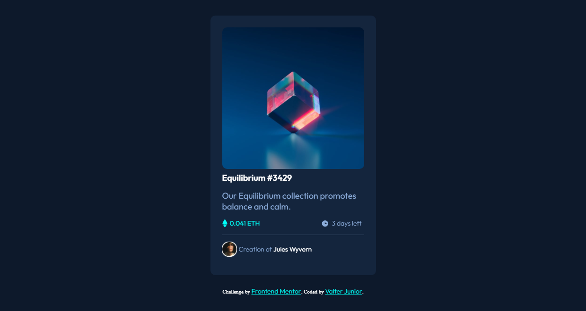

</img>

<h1 align="center">NFT preview card component</h1>

    <h3>
        <a href="https://junior2105.github.io/NTFCard-FrontEnd/" target="_blank">Live</a>
         | 
        <a href="https://www.frontendmentor.io/solutions/ntf-by-vjrx-IJLHnHnQj" target="_blank">Solution</a>
         | 
        <a href="https://www.frontendmentor.io/challenges/nft-preview-card-component-SbdUL_w0U" target="_blank">Challenge</a>
    </h3>

   Solution for a challenge from  <a href="https://www.frontendmentor.io/" target="_blank">frontendmentor.io</a>.

   

## Built With

### Languages and Tools

- HTML5
- CSS3

### Useful resources

- [BORDER IN A .PNG](https://stackoverflow.com/questions/12690444/css-border-on-png-image-with-transparent-parts) - this helped me put the white border on the avatar. I really liked this pattern.

## Author

- Website - [ValterJr](https://github.com/junior2105/)
- Frontend Mentor - [@VJr](https://www.frontendmentor.io/profile/junior2105)
- Instagram - [@vjrx._](https://www.instagram.com/vjrx._/)
